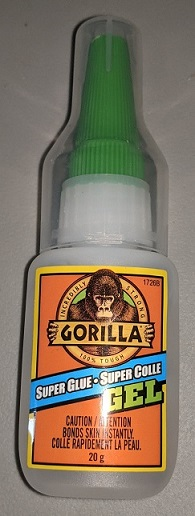
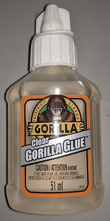

# Material prerequisite

## Electronics

| Description | Quantity | URL 
|---|---|---|
| MOSFET P Channel | 1 | https://www.aliexpress.com/item/32884055864.html |
| NPN Transistor (BC337) | 1 |  |
| LEDs WS2812B | 100 | https://www.aliexpress.com/item/1005002657432751.html |
| 693ZZ bearings (8mm wide, 4mm thick, 3mm inner)  | 9 |  https://www.aliexpress.com/item/557757520.html |
| M5Stack Official M5Stamp Pico | 1 |  https://www.aliexpress.com/item/1005003449579749.html |
| LiPo Charger with 5v boost |   | https://www.aliexpress.com/item/4000935870120.html |
| LiPo battery | 4x 100mA  | https://www.aliexpress.com/item/32853990764.html (any will do as long as it fit into the ring) |
| ESP32, example: Lolin32 | 1 | Any with enough output pin will do. |
| Fermion DFPlayer Pro Mini MP3 | 1 | https://www.aliexpress.com/item/4000394488862.html |
| DRV8825 Stepper Motor Controller | 1 | https://www.amazon.ca/-/fr/DRV8825-remplacement-TMC2208-Dissipateur-thermique/dp/B095LRJR2S |
| Resistors kit | |
| Capacitor kit | |
| A few schottky diodes | |
| All kind of wires | (24 to 26 AWG mostly) |
| 12 volts to 5 volts step converter (2A) | 1 | https://www.aliexpress.com/item/1005001534795169.html
| 12 mm tactile switch | 1 | 
| Hall-Effect Sensor Digital 3144 | 1 | https://www.aliexpress.com/item/32823025060.html (Any will do as long as it's digital)
| JST Connecteur Kit 2.54 mm | 1 | https://www.amazon.ca/Bestgle-Connector-JST-XHP-Housing-Adapter/dp/B07MBCLPBK/ref=asc_df_B07MBCLPBK/

## Mechnical parts

| Description | Quantity | URL |Comments
|---|---|---|---|
| NEMA 14 stepper | 1 | https://www.amazon.ca/0-9deg-steps-Precision-Stepper-15-6oz/dp/B00PNEPZQC
| 4x2 mm magnets  | 160 | https://www.aliexpress.com/item/1005002591601630.html |
| Privacy film  | 25x25 cm at least | https://www.aliexpress.com/item/32967449727.html |
| Copper tape  | 1 | https://www.aliexpress.com/item/1005002822966859.html |
| Plexiglass 20x20cm (recommend buying spare)  | 1 + 1 spare | https://www.aliexpress.com/item/32833660352.html |
| Servo 9g | 1 | https://www.amazon.ca/-/fr/Servo-num%C3%A9rique-Micro-Metal-mod%C3%A8le/dp/B07FPJYM5T | I tried cheap one but they proved to be problematic, one died suddently and the other draw too much current sometime. You may have to invest in something better.
| M2 screws kit | 1 | https://www.amazon.ca/-/fr/Hilitchi-Assortiment-hexagonale-acier-inoxydable/dp/B014ONS02S | You needs several lengths
| M3 screws kit | 1 | https://www.amazon.ca/Assortiment-cruciformes-cylindrique-acier-inoxydable/dp/B075RCVVYN/ | You needs several lengths

## 3D Printing parts

| Description | Quantity | URL
|---|---|---|
| Nozzle 0.2mm | 1 | Required to get nice results

## Recommendations

| Description | Quantity | URL
|---|---|---|
| Dremel Purple Glue | 1 | https://www.amazon.ca/Dremel-GS45-01-Glue-Sticks/dp/B077FVQ3DX
| Magigoo | 1 | https://shop3d.ca/products/magigoo-3d-printing-adhesive-50ml?variant=27936894287950&currency=CAD&utm_medium=product_sync&utm_source=google&utm_content=sag_organic&utm_campaign=sag_organic

## MISC

| Description | Quantity | Description
|---|---|---|
| Gorilla Super Glue | 1 | Used to glue the most important parts.
| Canopy Glue | 1 | Need a glue that turn transparent. Gorilla glue stain the plexiglass and leave horrible traces.
| Hot Glue | 1 | It could be done with canopy glue too but it's easier to remove hot glue if necessary.
| Small clamps to hold parts while curing | 1 | 

  

## Required plastics

Basically color is up to you, but you will probably needs at least 3 colors.

| Color | Used for | Description
|---|---|---|
| Dark gray or black PLA | Ring | The ring in the serie is almost black if not black. The one I made was gray but not dark enough, if I could do it again I would likely make it black |
| Transparent PLA | Ring | Used for chevron illumination and light diffusion. It may be possible to use white instead but I suggest you to test it before commiting yourself.
| White PLA | Ring/Base | Used for reflector but can be used for any parts that is not visible. (example, bearing module, inner ring, alignment block etc ...)
| Sand PLA | Base | Sand like color, yes I realise there are many possible color for sand so let's say the same color as egypt pyramid?
