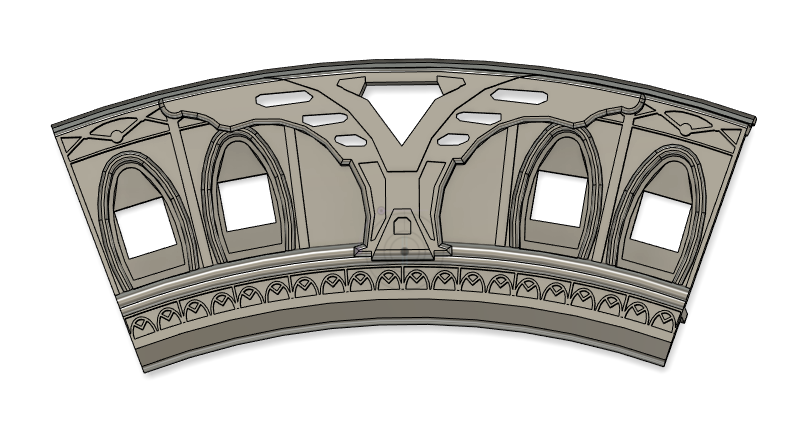
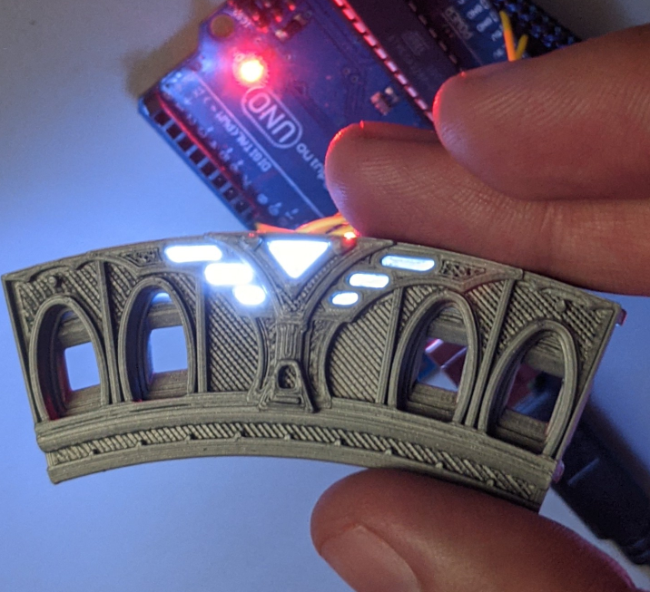
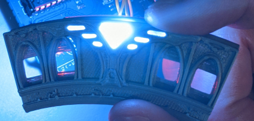
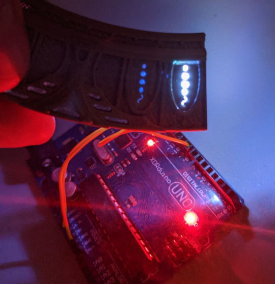

# Recommendation

## Before printing

We provide "TestPart-Stargate-Front.stl" part to test printing 1/9 of the front stargate part. 
It allows you to test material or print settings before doing the big part.

We recommend you to print these parts using the color or plastic of your choice :

- TestPart-Stargate-Front.stl
- Light-chevron-0.2mm_x18.stl
- symbol-light-guide_0.2mm-x36.stl
- symbol-template1_0.2mm-x1.stl

It is better if you also have one WS2812B to test the chevron and symbol lightning. 
The LED shouldn't be at full power to test symbols, only 5/255 PWM is enough to see it clearly. 
It could be higher for chevron but your don't gain anything going beyond 160/255 except excessive power loss. 

If you want to use a resin printer for symbols you can, but you will likely have to paint them because resin transparency is not adequate in our experience.

