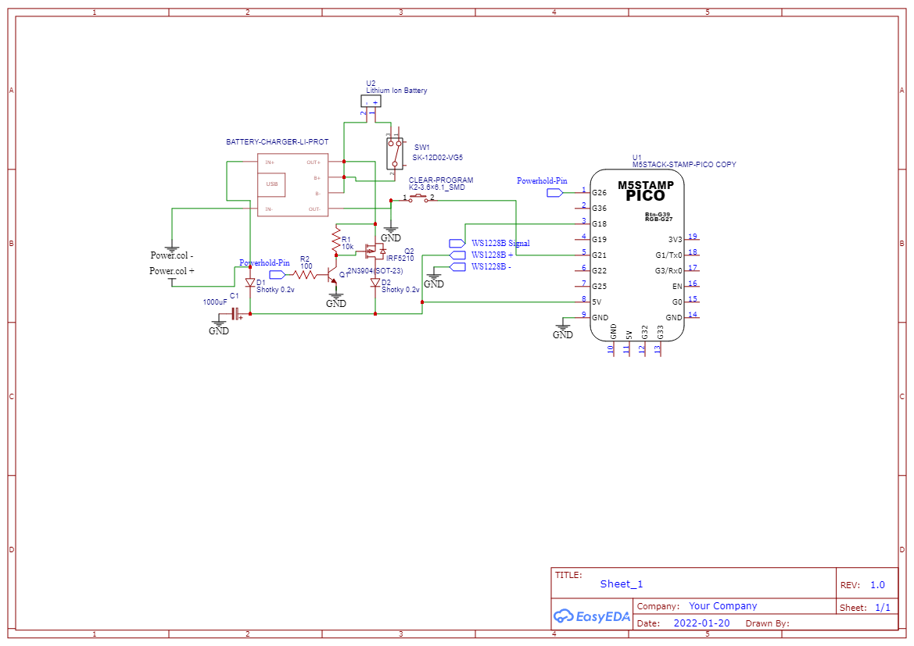

# Internal electronic

## Solder and assemble

- Solder the header necessary to easily program the M5Stamp Pico. The header should be accessible when the ring is disassembled.

***WARNING:*** It should be female header soldered to the M5Stamp Pico, but the picture show male header.

- Install batteries using hot glue. You don't need to put a lot, just tacking is good enough.

- Assemble electronic according to this picture: (You are under no obligatoire to position parts this way, but ensure to balance weight as much as possible)
** Warning: ** Unfortunately there are not a lot of picture of this part. Earlier you installed a connector for WS2812B leds, you will have to soldier the other half of the connector according to the plan.

## Program the M5Stamp Pico

***Warning:*** This chapter won't explain how to program an ESP32, there are plenty of existing tutorial to explain it.

- You need to connect the M5Stamp pico programmer to the M5Stamp pico.
- Flash "ring-factory" app into it.

#### ADD MORE DETAILS HERE LATER ####

