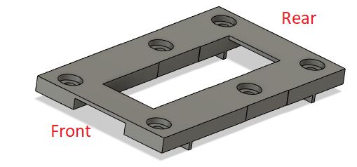
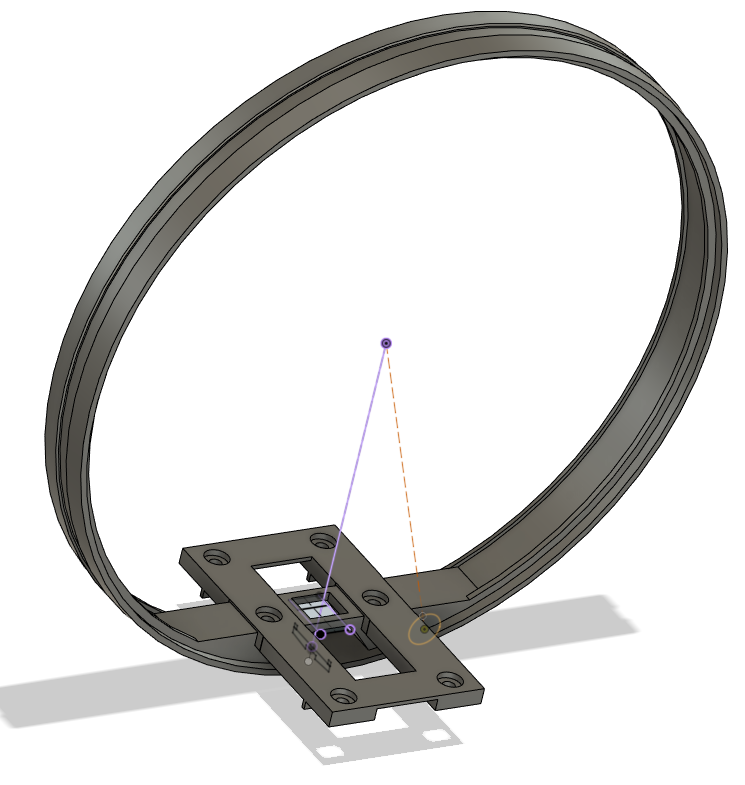
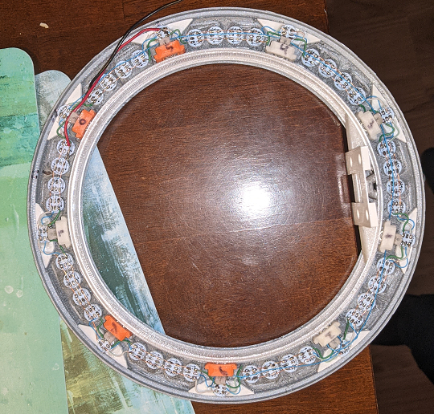
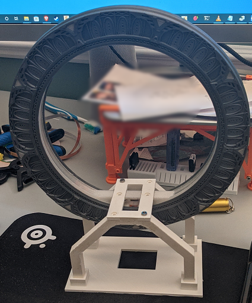
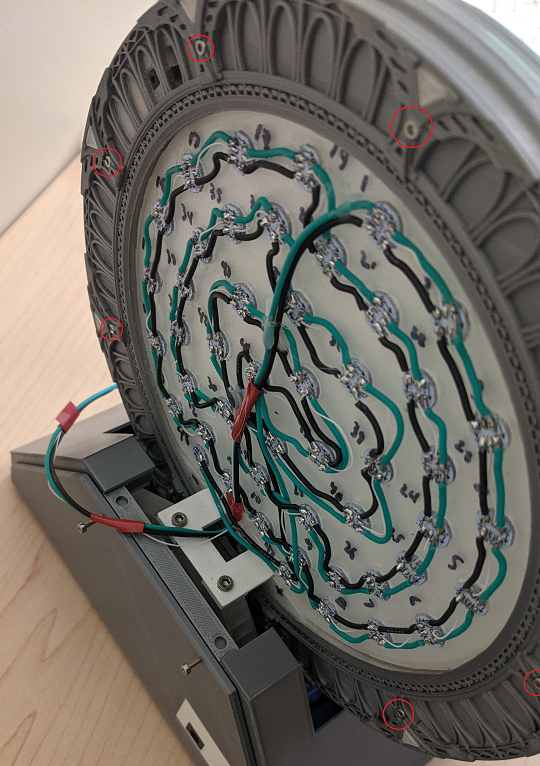

# Inner ring

## Sanding

- You need to sand the inner ring using 180 / 400 grid sandpaper, the middle track will be run over by the bearing.
the slighest flaw will make it works badly.

## Glue the cradle

- You will need gorilla glue, clamp and 10 mm M3 screw. M3 screw are only used for alignment, glue is what matter to hold parts together.

- It will looks like this once glued:

- Once the glue is set, you can remove M3 screw and fill the hole with more glue. 

## Install the inner ring into the ring

- Install the inner ring into the center, ensure it's in the ring direction relative to the outer ring. 
- Install bearing modules in place
- Number bearing module with sharpie starting from the master chevron as #1, go counter-clockwise. Mark again the master chevron anywhere it could help.

I hope you didn't glue the bearing module in place
It should looks like this:

## Install screws

This step is necessary to ensure the gate spin correctly before going further. 
You will need to screw both halves in place using M2x15 screws (shorter can do it too).

There are 9 screws that fit in the back of the gate.

### Ensure it spins

Try to make it spins freely, if required sand again the inner-ring or the edge of the outer-ring.
If everything is fine, continue to next step but you will need to remove screw later.