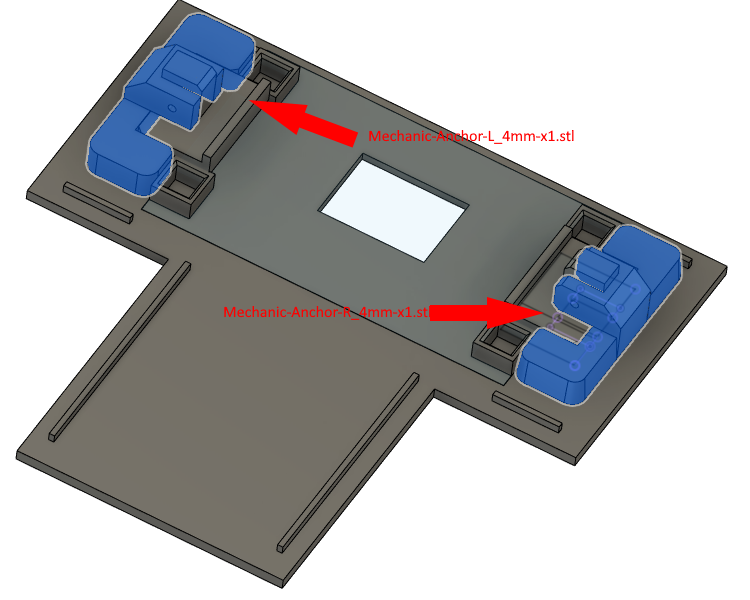

# Base assembly

Don't worry about the ringmotor assembly, it could be inserted later.

 - You need a lot of small clamp if you want to do a decent job. I have found them at dollar store and they worth every penny.
 - Gorilla glue or canopy glue

 

## Glue base parts #1

Glue all those parts together, use the picture to guide you.
You needs those part to continue:

 - Outer-bottom-plate_4mm-x1.stl
 - Outer-bottom-plate2_4mm-x1.stl 
 - Outer-front-plate_4mm-x1.stl
 - Outer-side-plate#1_4mm-x1.stl
 - Outer-side-plate#2_4mm-x1.stl

 

## Glue base parts #2

Glue Outer-back-plate_4mm-x1.stl to the existing base part #1.

 

## Glue base parts #3

You needs to ensure "Bottom-plate-v2_4mm-x1.stl" is in place, IT SHOULDN'T BE GLUED! The part is designed to be removable. It's only there to use as a guide when "Mechanic-Anchor-L_4mm-x1.stl" and "Mechanic-Anchor-R_4mm-x1.stl" get glued.

Ensure to not accidentally glue anything else, don't put too much glue.
Use clamps to hold these parts in place.

To be glued to "Outer-bottom-plate_4mm-x1.stl"
- Mechanic-Anchor-L_4mm-x1.stl
- Mechanic-Anchor-R_4mm-x1.stl

These parts should be in place, but NOT GLUED, only as a guide:
- Mechanic-Archor-p2-L_4mm-x1.stl
- Mechanic-Archor-p2-R_4mm-x1.stl

Once everything is cured, you can remove "Mechanic-Archor-p2-L_4mm-x1.stl" and "Mechanic-Archor-p2-R_4mm-x1.stl" by sliding them.

 

It should looks like this once once you remove "Mechanic-Archor-p2-L_4mm-x1.stl", "Mechanic-Archor-p2-R_4mm-x1.stl" and "Bottom-plate-v2_4mm-x1.stl".

 

## Install M2 screws

You needs two M2 nuts and a soldering iron or a ligher.
You need to push heated M2 nuts into designated holes. Be careful to now overheat.

## Glue base parts #4

Glue side covers, you needs to use clamp and maybe tape. Use painter tape where clamps are not a good option.

- Side-back-cover-L_4mm-x1.stl
- Side-back-cover-R_4mm-x1.stl

 

## Install RingMotor assembly in place

You can install the ring motor assembly if you want.
All you have to do is insert the assembly where it should go then slide these parts:

- Mechanic-Archor-p2-L_4mm-x1.stl
- Mechanic-Archor-p2-R_4mm-x1.stl

You can use an M3x25 screws to secure it in place but friction should be enough.

## Install the reinforcement.

You can install "Outer-back-plate-reinforcement_4mm-x1.stl" using two M2x12 screws (not exactly sure about the length).
The base is designed to allow the mecanism to be removed freely.

## Install back-cover (Outer-back-cover_4mm-x1.stl)

This part is designed to accommodate pretty much any barel jack or connector. 
But you have to design it yourself, use "Outer-back-cover-plug_4mm-x1.stl" as a template.
You can glue it to "Outer-back-cover_4mm-x1.stl" using gorilla glue.
The back cover is designed to hold using M2x15 screws. It is screwed into plastic because it doesn't needs real structural integrity.

