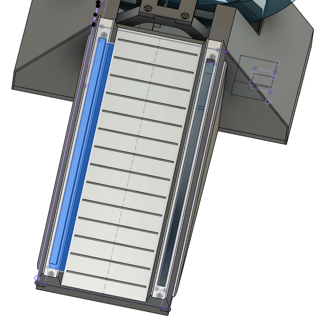
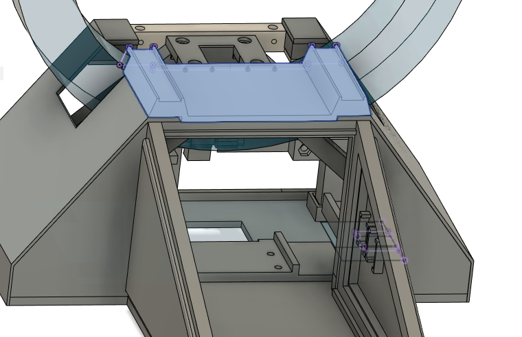

# Base assembly #2

## Assemble ramp lights

"ramp-light-guide_4mm-x2.stl" are meant to be printed using transparent PLA.

Insert "ramp-light-guide_4mm-x2.stl" into their locations on "Ramp_4mm-x1.stl", use canopy glue because gorilla glue may have white residues.
The ramp is designed to be removed easily at will. You can add magnets into it if you want, there are holes for it but it's not necessary. 

## Install "top-cover_4mm-x1.stl"

Install it on the top, friction alone should be enough to hold it in place but you can glue magnets if you want.

