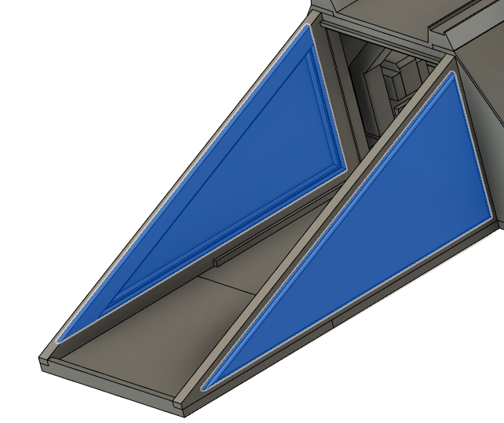
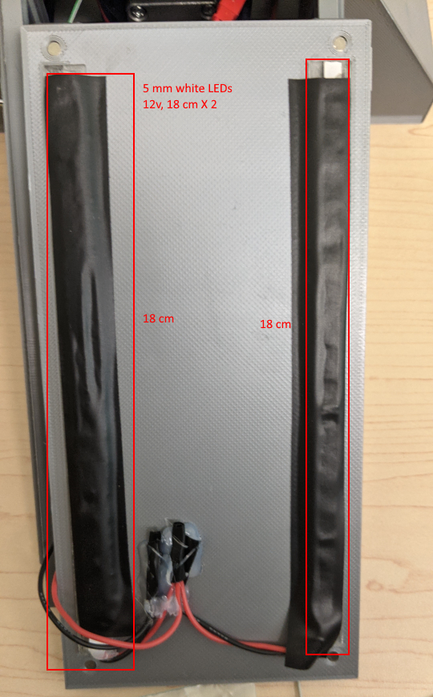

# Base assembly #2

## Assemble ramp lights

"ramp-light-guide_4mm-x2.stl" are meant to be printed using transparent PLA.

Insert "ramp-light-guide_4mm-x2.stl" into their locations on "Ramp_4mm-x1.stl", use canopy glue because gorilla glue may have white residues. 
The ramp is designed to be removed easily at will. You can add magnets into it if you want, there are holes for it but it's not necessary.

## Install "top-cover_4mm-x1.stl"

Install it on the top, friction alone should be enough to hold it in place but you can glue magnets if you want.

## Install side ramp covers

If they hold by themselves just by friction then don't glue them, it's covenient to be able to remove them when working in the electronic zone under the ramp.

- Side-ramp-cover-L_4mm-x1.stl
- Side-ramp-cover-R_4mm-x1.stl

## Lamp lightning

- You need to cut a 12 white led strip into two 18 cm strips.
- Wire them in parallel and add a connector to it.
- Glue led strip under "ramp-light-guide_4mm-x2.stl", use clamp to hold them in place during the the curing process.
- Add electrical black tape to prevent light from leaking elsewhere

