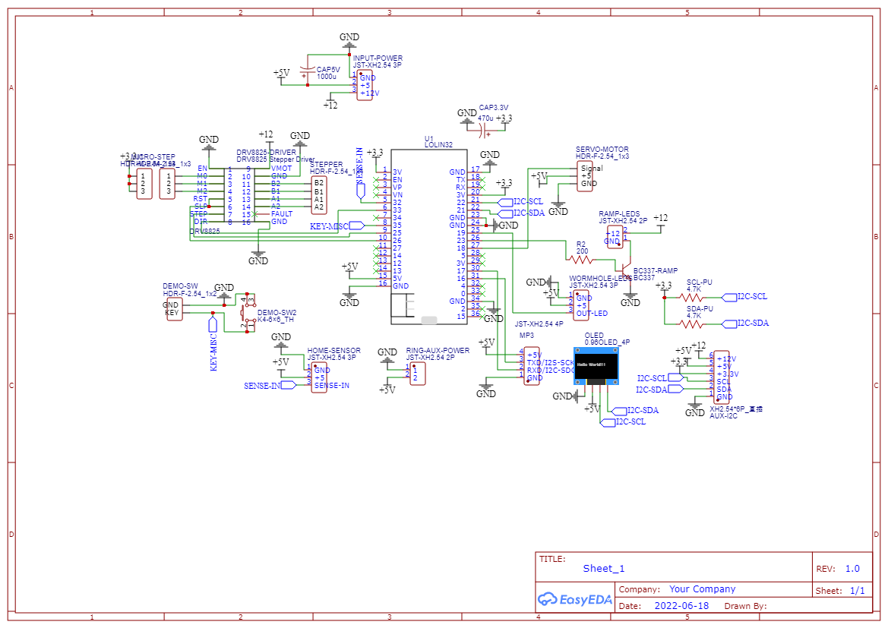

# Base electronic

We use the Lolin32. Former attempt using NodeMCU didn't go well. Likely a bad copy.

 - You can use JST connector or anything else as long as it suit your needs. You can also just solder everything to the board but it's not recommended.

Knowns issues:

 - We used 1A 12v to 5v regulator from dollar store, it proved to be unsufficient in some situation like when the servo motor move or the board starts. So 3A or more should be better.

# WS2812B

Based on empirical measurements, there is the average power consumption for WS2812B. 
It needs ~1 mA at 0 PWM.

| Channel | Power usage at 255 (mA) |
|-------------|----------|
| RED	      | 13.14084507 |
| GREEN	      | 13.01408451 |
| BLUE	      | 13.16901408 |
| RGB (White) | 35.38 |

## Stepper Driver (DRV8825)

We use a DRV8825 but you can use anything else.
We run in 1/16 steps but it's possible to go higher or lower, but it will require some software changes.
It sounds better at 1/16 but it's perfectly workable at 1/8.

| M0 | M1 | M2 | Microstep Resolution
|---|---|---|---:|
| Low | Low | Low | Full step
| High | Low | Low | 1/2 step
| Low | High | Low | 1/4 step
| High | High | Low | 1/8 step
| Low | Low | High | 1/16 step
| High | Low | High | 1/32 step
| Low | High | High | 1/32 step
| High | High | High | 1/32 step

The photo is old, I used JST connector later because the job is prettier.
(No attachement in this photo, perhaps a STL for attach will be made later)

The OLED screen is not mandatory

## Program the ESP32

***Warning:*** This chapter won't explain how to program an ESP32, there are plenty of existing tutorial to explain it.

- Connect a USB cable to the base ESP32.
- Flash "ring-fw" app into it.
- Connect to "SGU-Base-XXXXXX" Wi-Fi access point without password.
- Access to http://192.168.66.1 using a browser. You should get access to the control program.