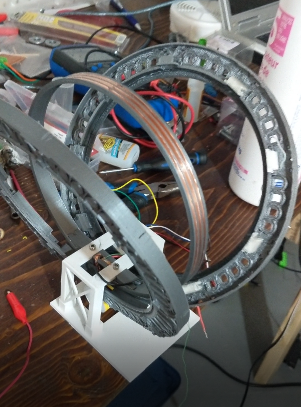
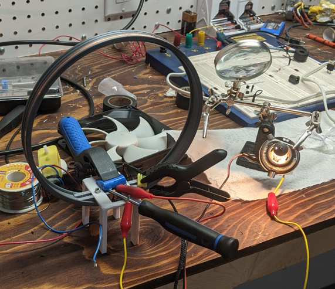
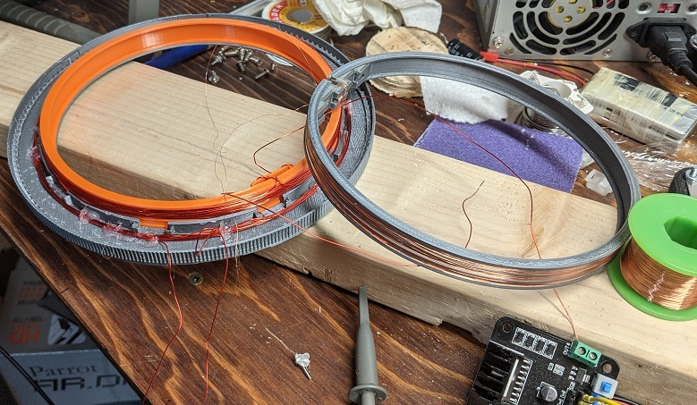
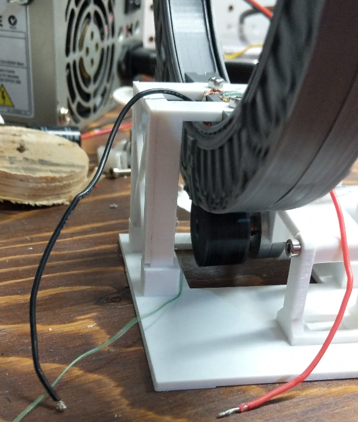
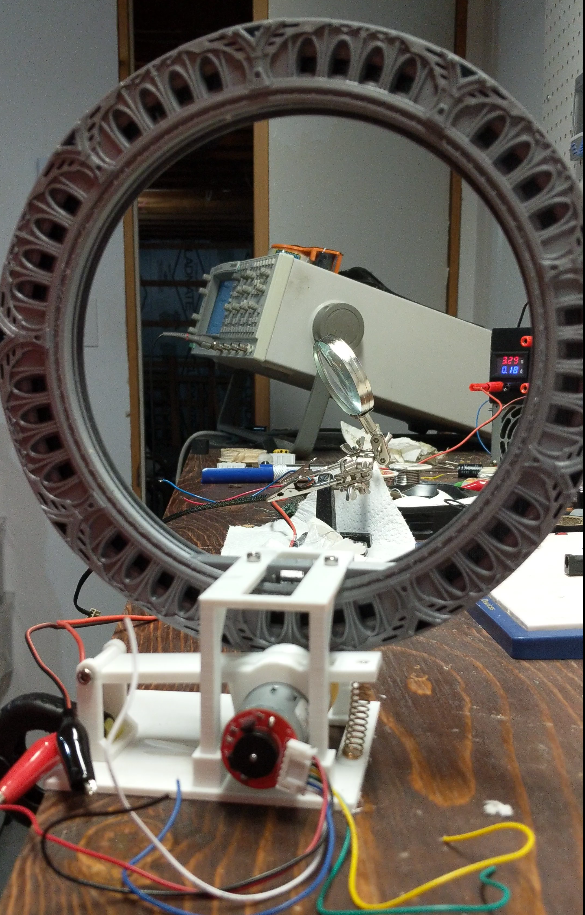
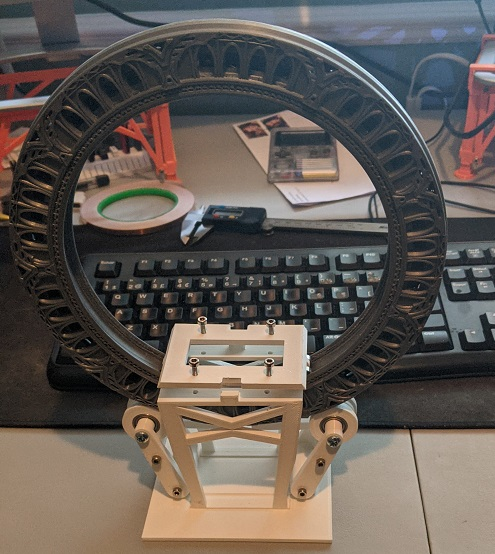
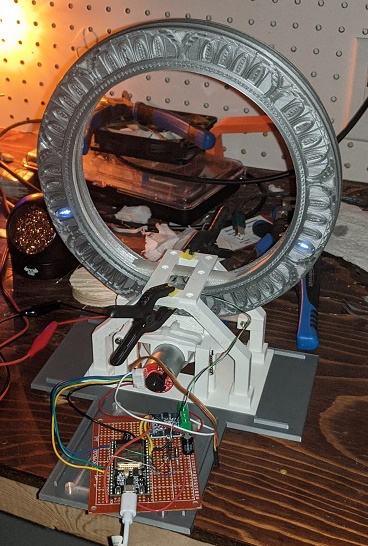

# Failed prototypes

Many attempt were made before making a functional version. There is a small list of failed prototypes in case you are curious.

## Slip ring attempt

The first attempt used an home made slip ring with 3 tracks, one for GROUND, one for POSITIVE, one for SIGNAL.
It used cooper tape for track, the middle track is also used to guide bearings.
It didn't work because it created too much friction, I tried make my own brushes by cutting graphite but it was a fail. Also conductive glue is surprizingly hard to find or ridiculously expensive so my attempt to make my own conductive glue as also a failure.

## Powered by induction

We successfully lighted up a LED for a few minute then it stopped and never worked again. Anyway it was doomed to fail, we probably just created an illegal emitter by accident in the end.

## Friction wheel

Because I couldn't resolve myself to deface the back of the gate by putting a visible gear there I tried using different friction material with a wheel.

Using TPU:

Using sanding paper:

## With bearing outside the ring

This one is an epic fail, it could barely old itself and was ridiculously shacky.

## Use a DC motor

The motor had small backlash and not enough mechanical stiffness. Also the encoder didn't have required resolution.
Stepper with 1/16 steps does a better job.

