# Ring assembly

- Print "Stargate-Front-0.2mm_x1.stl" using 0.2 mm nozzle. Recommend using Tree Support with BRIM, no raft. May takes ~40h to print.

- Print "Stargate-Back-0.2mm_x1.stl" using 0.2 mm nozzle . Recommend using Tree Support with BRIM, no raft. May takes ~40h to print.

- Print "Light-chevron-0.2mm_x18" 18 times using 0.2 mm nozzle 

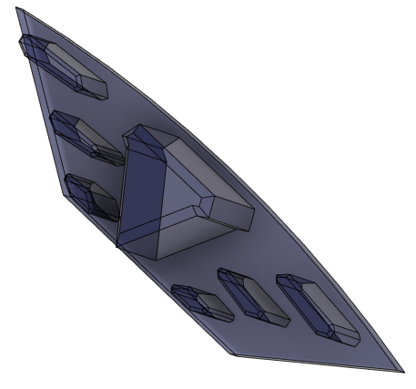

- Print "Alignment-block-0.2mm_x9" 9 times using 0.2 mm nozzle

- Print "Module-With_wheel-0.2mm_x18.stl" 18 times using 0.2 mm nozzle. Color doesn't matter.

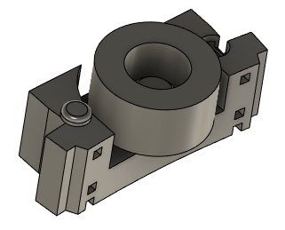

- Print "Light-chevron-cover-0.2mm-x9" 9 times using 0.2 mm nozzle. Using white PLA, it will reflect light.

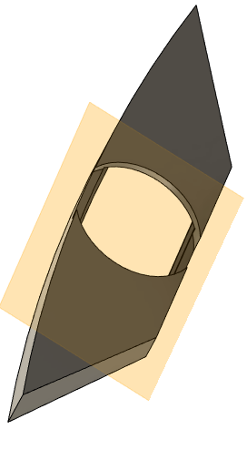

- Print "Stargate-Back-TransWindow-0.2mm-x10-12" 12 times using 0.2 mm nozzle. Use transparent PLA or white.

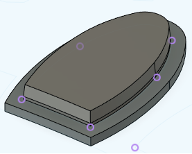

- Print "Stargate-Back-Transparent-ResetBtn_0.2mm-x1" 1 time using 0.2 mm nozzle. Use transparent PLA or white.

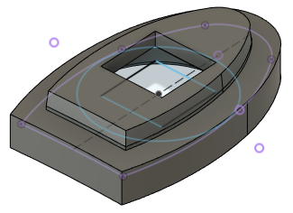

- Print "Stargate-Back-Transparent-PwrSw_0.2mm-x1" 1 time using 0.2 mm nozzle. Use transparent PLA or white.

- Print "Magnet-ring" 1 times using 0.2 mm nozzle. Color doesn't really matter.

- Print "symbol-light-guide_0.2mm-x36.stl" 36 times using 0.2 mm nozzle. Should use transparent or white PLA.

- Print every symbols 1 times using 0.2 mm nozzle. Should use gray PLA.
You can use a resin printer to print them and get better resolution, but resin is more transparent than gray PLA. You will need to paint the symbols after if you want correct effect using resin or too much light will go through.

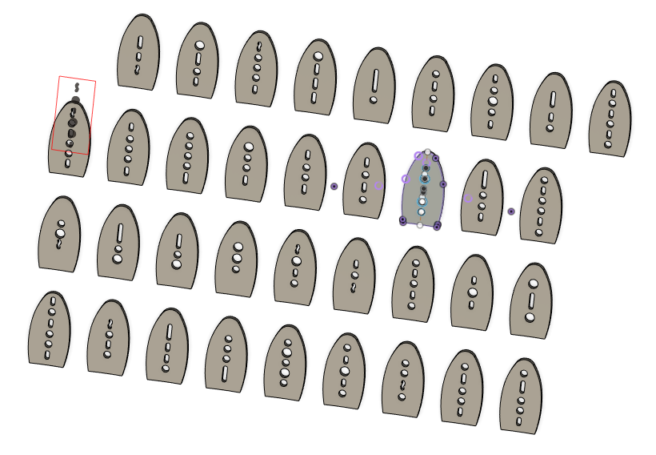

- Print "Inner ring" 1 times using 0.4 mm nozzle. Color doesn't really matter.

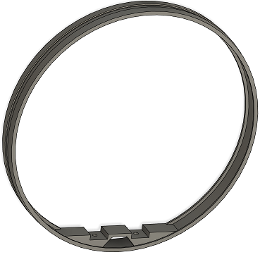

- Print "Inner-ring-sensor-holder_0.4mm-x1" 1 times using 0.4 mm nozzle. Color doesn't really matter.

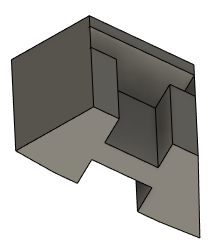

- Print "Home-magnet-holder_0.4mm-x1" 1 times using 0.4 mm nozzle. Color doesn't really matter.

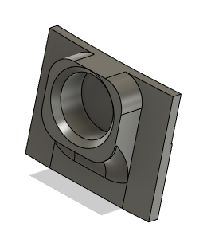

## Assemble alignment block and chevrons light diffuser

Use this picture as reference: 

# Lightning diffuser for chevrons
- Insert "Light-Chevron" into place on "Stargate-Front" and "Stargate-Back". You may need a hammer and a big metal part to force it. Be gentle to now destroy the parts. You can print "Chevron-insert-tool.stl" too to help.

# Alignment blocks
- Insert "Alignment-block" into place on the "Stargate-Front" part. 
Ensure the holes are clear and everything fit. Then glue them in place, pour gorilla glue into the hole then install the alignment blocks.
- Use a sharpie and mark a chevron as being the "master chevron" on both side. Doesn't matter which one it is but it should have a master chevron. It's labelled M.C on the picture above, use the same pattern.

# Test
- Try to assemble "Stargate-Front" and "Stargate-Back" together to ensure alignment block are meshing together.

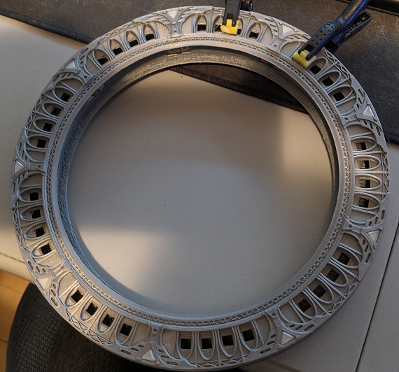

# Assemble bearing modules

- Ordered bearing comes with not so great grease, put some WD40 or Jig-A-Loo into bearings. Be careful, Jig-A-Loo attack PLA a little bit, if you clean the part with a towel the color of the PLA stain the paper so ...
- Modules are made of two part meant to mesh together and hold the bearing in sandwitch.
The part is printed 18 times so you will have 9 modules.
So the tolerance are very tight, you will have to use a lot of force to insert the bearing. If it's not hard to insert then something is wrong and you may need to change the design of the part or trying print it with lower resolution. We suggest you to use a wrench or c-clamp to force two part together.
- Use gorilla glue to glue both part together and use clamp to hold parts

- Insert the completed modules in their final spaces to ensure everything fit in place.

***Warning***: DO NOT GLUE THE MODULES to the stargate-back or stargate-front! they will never need to be glued. They will hold in place by themselve once both halves get assembled.

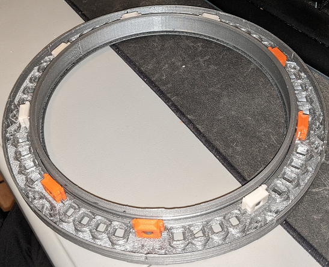

# Assemble symbols

Tolerance are so tight that you will need a hammer to insert symbols in place and you need to put something behind the gate to avoid destroying it. 
You don't need glue. It may be possible you need to sand a bit to insert symbols.

- Put each "symbol-light-guide_0.2mm-x36" (36 of them) into symbol holes. You can try lighting up a LED behind to ensure they diffuse light correctly.

- Insert symbols in each holes at correction positions according to the chart, the master chevron should be positionned as top most according to your previous marking.

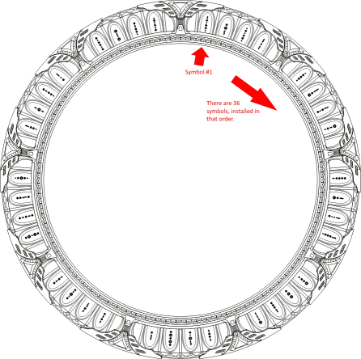

# Assemble lights reflectors (Light-chevron-cover)

The reflectors are meant to reflect light and give a better effect so it's important to print them with white color.

- Glue "light-chevron-cover" using canopy glue over chevron "Light-chevron".
- Glue WS2812B leds over holes, there are 45 LEDs to glue using canopy glue. It's important for chevron LEDs to be as close as possible to "alignment-block" and not interfere with the ring groove. Magnet ring will be fitted there later. ** WARNING: ** There is an arrow on each LEDs, they should point in counter-clockwise direction. (See the picture)
- Starting with the "master chevron" LED, solder all LEDs positive and negative terminals. Ensure to connect the last LED to the master chevron LED to reduce voltage peak. You can use nacked wire. **Warning: ** Ensure to not overheat with the soldering iron. Be very careful to not melt the plastic under it.
- Starting with the "master chevron" LED, solder every data wire, start with the output of the master chevron LED, then connect to the next etc ...
The master chevron LED data input should be where the microcontroller will be connected later. Recommend to use very small gauge, like 28 awg.

- Add tape over symbol LEDs to project from accidental short circuit.
- Add a 3 pins connector on the master chevron LED. Servo motor connector or JST can do the job. One ground, one positive and the WS2812B led data input.

# Assemble stargate back window

You needs those parts:
- Stargate-Back-TransWindow-0.2mm-x10-12.stl (x1)

- Stargate-Back-Transparent-ResetBtn_0.2mm-x1.stl (x1)

- Stargate-Back-Window-pushbutton_0.2mm-x1.stl (x10)

### Power collector

- Use two "Stargate-Back-TransWindow-0.2mm-x10-12", wrap them using cooper tape. 
** Warning: ** The back of the cooper tape is not conductor at all, ensure both side are covered by the same piece.
- Glue them in place using gorilla glue
- Use a sharpy to mark the positive and the negative inside the ring.
- Insert the magnet into "Home-magnet-holder_0.4mm-x1" and glue it in place on "stargate-back" (check the photo for details)

Hall sensor are sensitive to polarity, so you need to test it before attempting to insert it in place.

- Mark polarity inside the track using a sharpie. It won't be visible once assembled.

### Other windows

- Glue other transparent window and buttons using this pattern.

# Magnetic ring

Odd position magnets should not have the same polarity as even magnets.
**WARNING** Recomment to install the magnet ring into the "stargate-front" part and glue it in place before installing magnets.
Don't glue it too hard, just tacking is good enough as long as magnet don't move outside.

- Use the stack of magnets and put them in place starting from the top most magnets, skip one position every time.
- Flip the stack of magnets and put reverted polarity magnet into remaining holes.
- You can add some canopy glue over magnets to hold them in place. Not too much.

The photo doesn't show it installed inside the "stargate-front" because I don't have any photo of it.

This photo comes from an ealier prototype, as you can see there is no location for modules on it but if you check the magnet ring inside the groove it should looks like this when assembled with all magnets in place.

