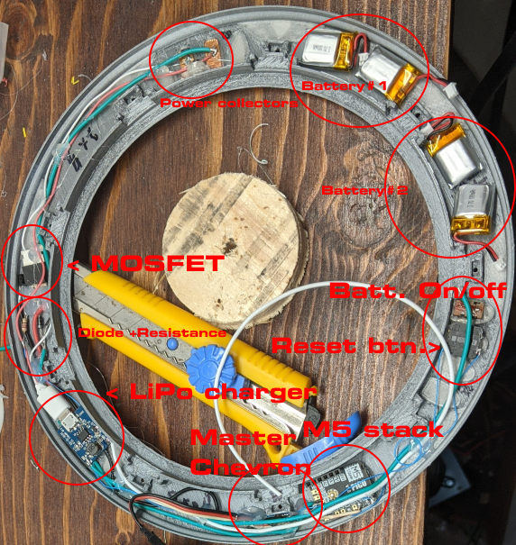

# Internal electronic

## Solder and assemble

- Solder the header necessary to easily program the M5Stamp Pico. The header should be accessible when the ring is disassembled.

- Install batteries using hot glue. You don't need to put a lot, just tacking is good enough.

- Assemble electronic according to this picture: (You are under no obligatoire to position parts this way, but ensure to balance weight as much as possible)
** Warning: ** Unfortunately there are not a lot of picture of this part. Earlier you installed a connector for WS2812B leds, you will have to soldier the other half of the connector according to the plan.

## Program the M5Stamp Pico

***Warning:*** This chapter won't explain how to program an ESP32, there are plenty of existing tutorial to explain it.

To start, the gate needs to receive power from power collector (DON'T REVERSE POLARITY!) at least to start, then the ESP32 can hold it's own power using the MOSFET. But if you power it using the programmer it will stay powered.

- You need to connect the M5Stamp pico programmer to the M5Stamp pico.
- Flash "ring-factory" app into it.
- Prime the ring or let it connected to the programmer, chevron should blink with a nice pattern.
- Connect to "SGU-Ring-Fact-XXXXXX" Wi-Fi access point without password.
- To flash with the new firmware, you should send the firmware "ring-fw.bin" to 192.168.66.1:8888 using any program that will just send the content of the bin using TCP socket.
    - Example: using netcat: nc 192.168.66.1 8888 < ring-fw.bin
    **Note:** Yes it sucks, but hopefully there will be a new version that support using an HTTP browser for update. I should also create 2 OTA partitions and use the factory-app only as an emergency measure.

## Program again

The bootloader of the factory app is programmed to automatically erase the last firmware if you hold the button for 5s after startup.
You can disconnect the battery using the toggle switch, hold the button, then prime the gate.