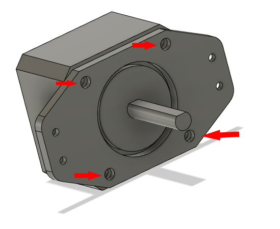
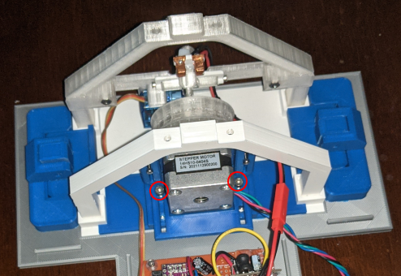

# Ring/base assembly

The design is relatively modular so you can make your own base if you want as long as the ring assembly fit into it.
It is partly designed as base and ring so I decided to create a specific chapter for this part.

## Instructions

- Glue "Truss#1_4mm-x1.stl" and "Truss#1_4mm-x2.stl" anywhere (check the picture). It's the same part.
Use Gorilla Glue, it's a structural part.

## Install the ring to the base

Use nuts to install the ring to the base. It allows to easily remove the ring later if necessary.

### Required parts

- "Bottom-plate-v2_4mm-x1.stl", "Truss#1_4mm-x1.stl" and "Truss#2_4mm-x1.stl".
- 4x M3x15 screws but as long as it fit it's fine it could be longer too.
- 4x M3 nuts

# Stepper-mount

## Install hidden nuts

This part is tricky because it may be required to use a lighter to insert M3 nuts into place.
If M3 nuts fit you can just fit them with force, but if it doesn't you can use the longest possible M3 screw you can find, install the M3 nuts to it, then use a lighter to heat the nut then push very hard on the plastic part to force it to enter. It will make the nuts fit perfectly and stay in place without using glue. 
You can also use a soldering iron to push on the nut but you need to be careful to not overheat.

## Glue to the bottom plate

Using Gorilla Glue, glue "Stepper-mount-1_4mm-x1.stl" to the "Bottom-plate-v2_4mm-x1.stl". 
Use clamp to hold the part in place and ensure glue won't go into the nuts.

# Install the stepper in place

## Install "Stepper-bracket_4mm-x1.stl" on NEMA14 stepper

Use 4x M3x10 screws to install the stepper bracket on the stepper.

## Install "Stepper-mount-1_4mm-x1.stl" to "Stepper-mount-2_4mm-x1.stl"

Use 4x M2x15 screw and 4x M2 nuts to install to hold both parts together. 
This part allows to adjust the bracket by loosing nuts.

## Prepare the magnetic gear

Use 4x2 mm magnet, push them into place using a screwdriver. Magnet should stay there by themselves, there is a small nudge to hold them. 
Odd position magnet and even position magnet shall have different polarity or it's not going to work. If you make a mistake there are hole behind the gear to push magnet out. If magnet have difficulty to hold in place you can drip some canopy glue or hot glue into the holes.

## Install the magnetic gear on the stepper

You may need to hammer the back of the shaft of the stepper until the gear press-fit into place. You may have to reajust later if it's not correct but the stepper can easily be removed to work on it. 
***WARNING:*** Hit the shaft, not the back of the stepper or you risk damaging to the stepper.

## Install "Stepper-mount-2_4mm-x1.stl" on "Bottom-plate-v2_4mm-x1.stl"

Use 4x 3Mx8 to install to the bottom plate. You can use only 2x 3Mx8 if you think it's enough.

It should looks like this in the end.

