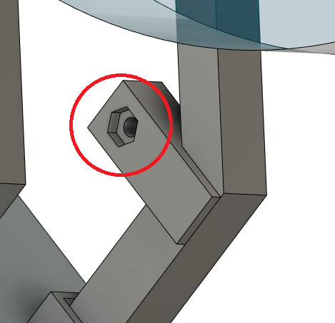
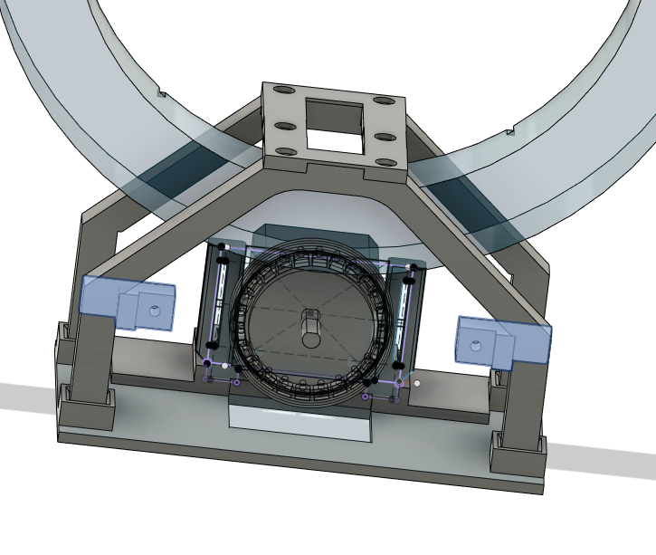
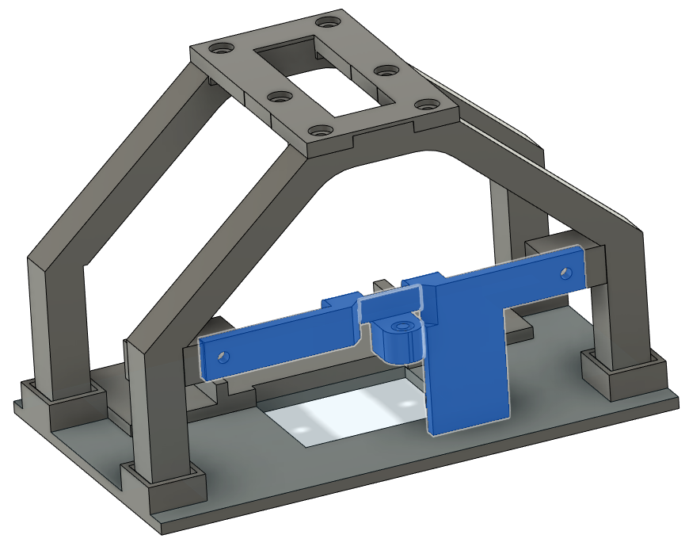
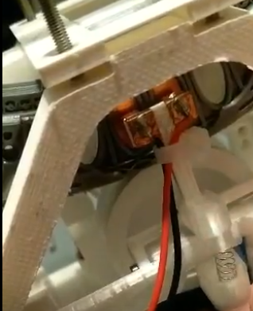
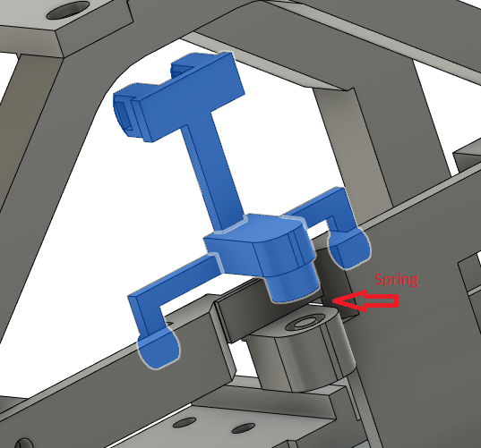
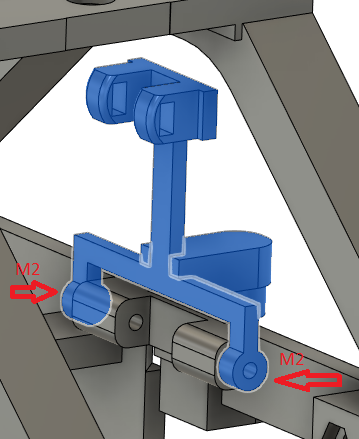
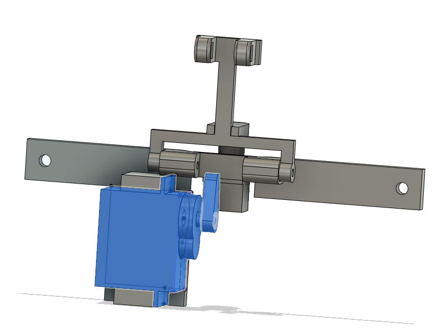
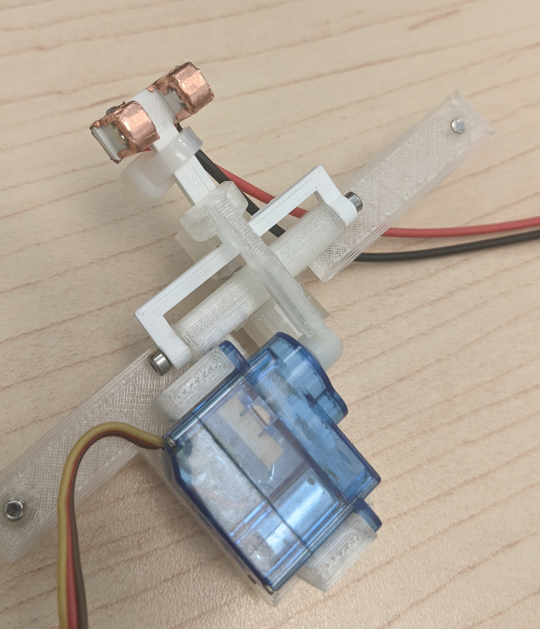
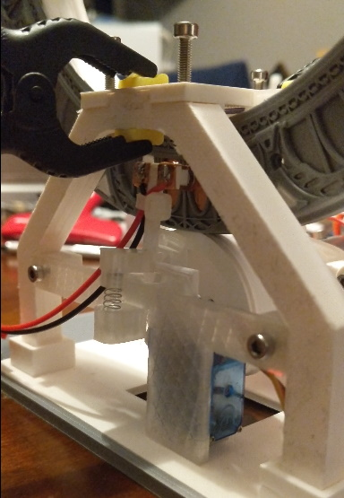
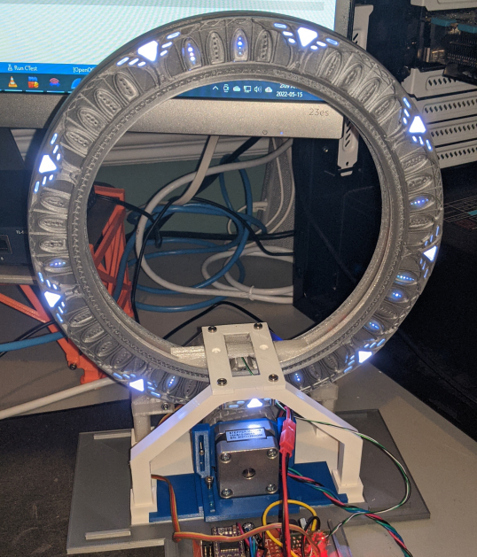

# Ring/base assembly

Install the power plunger. It allows to recharge the gate and keep it active when the master chevron is at the top.

## Install anchors (Back-plunger-anchor_4mm-x2.stl)

Ensure M3 nuts can fit into the back of each anchor. If it doesn't, just heat it in place with a solder iron until it fit.

Use Gorilla glue to glue both anchor into place.

## Assemble "back-plunger"

Glue "Back-plunger-bar_4mm-x1.stl" and "Back-plunger-Higher-spring_4mm-x1.stl" together using Gorilla glue.

## Assemble "Back-plunger-arm_4mm-x1.stl"

- You needs to wrap each contactor with cooper tape. 
- The left side (relative to the view on the picture) should be soldered to the ground, on a black wire if possible. The wire should be flexible, sillicon is the best.
- The right side should be soldered to positive (+5v). The wire should be flexible, sillicon is the best.

***WARNING:*** Don't heat too much, you should do it quickly to not melt the plastic.

Glue "Back-plunger-Higher-spring_4mm-x1.stl" to "Back-plunger-arm_4mm-x1.stl" using Gorilla glue.

Install a 4 mm by 30 mm spring, I used one coming from a pen. If it's too long you can cut it.

## Install the arm

Use two M2x20 screw to install the arm, shouldn't be too tight, the arm shoud be free to move.

## Glue the servo motor on (Back-plunger-bar_4mm-x1.stl)

Use canopy glue or gorilla glue to glue the servo to "Back-plunger-bar_4mm-x1.stl". Use a clamp to hold it in place.

## Glue the hammer (black-plunger-hammer_4mm-x1.stl, black-plunger-hammer-cover_4mm-x1.stl) to the servo arm

You may need to do some modification to your servo arm, there are difference between models.

## Install "Back-plunger-arm_4mm-x1.stl" in place

You just need to use 2 M3x10 screws to install the part in place.

