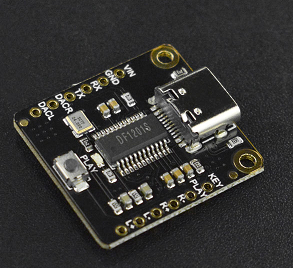
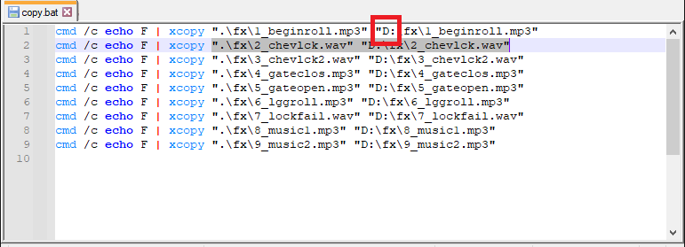
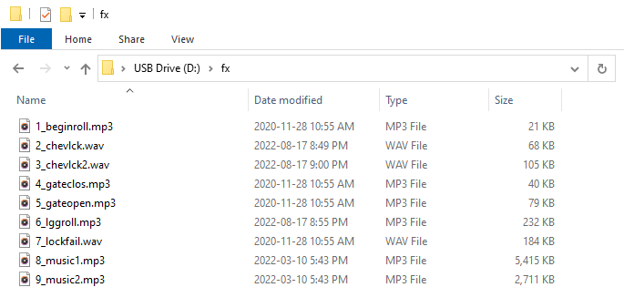

# Software

## URL

| Description | URL |
|---|---|
| Home page of the system | http://192.168.66.1/index.html
| Get many system informations | http://192.168.66.1/about-ota.html
| Get current settings (JSON) | http://192.168.66.1/settings.html

## About-OTA

Give system informations and allow to upload over-the-air (OTA) update

## Settings

You can get JSON settings by browsing at : ./settings.html
If you want to change settings, you can use insomnia or postman to POST your new JSON file at: ../api/setsettingsjson

## Mp3 Player

DF Robot Mini Pro (DF1201S). It has it's own USB drive so you can plug it to a computer and upload whatever you want.

The only way I found to play a specific file (the provided command for playing by name doesn't work) is
to use the file number. It is defined by copy order on the USB drive.

To add sound FX to the mp3 player:
- Connect it to a computer
- Access to the USB drive
- Locate .\SoundFX\copy.bat edit it to replace by the right drive letter

- Execute it.
- Ensure all file were copied on the USB drive. If you screw the order you can format it and do the procedure again.

## Index

Allows to control the gate, dial address or manually activate/deactivate lightning.

