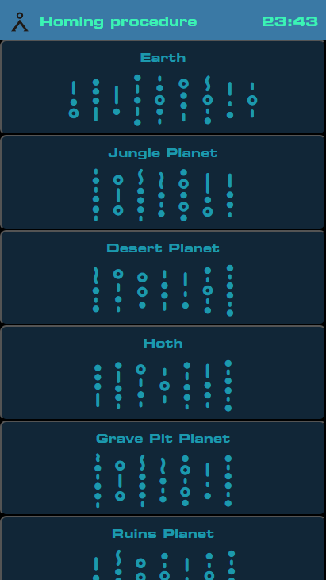

# Software

## URL

| Description | URL |
|---|---|
| Home page of the system | http://192.168.66.1/index.html
| Get many system informations | http://192.168.66.1/about-ota.html
| Get current settings (JSON) | http://192.168.66.1/settings.html

## About-OTA

Give system informations and allow to upload over-the-air (OTA) update

## Settings

You can get JSON settings by browsing at : ./settings.html
If you want to change settings, you can use insomnia or postman to POST your new JSON file at: ../api/setsettingsjson

## Index

Allows to control the gate, dial address or manually activate/deactivate lightning.

