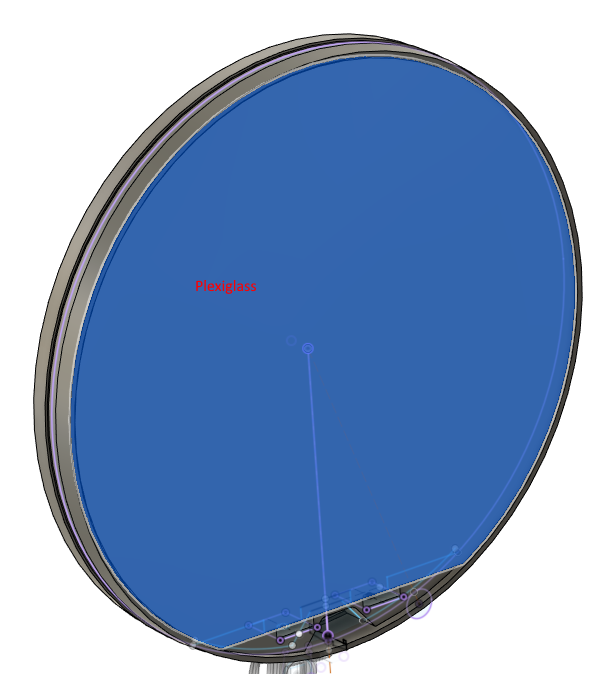
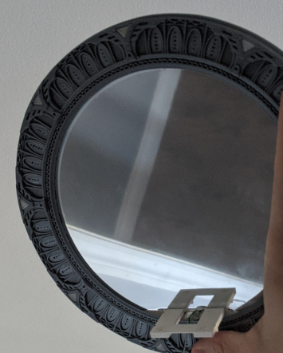
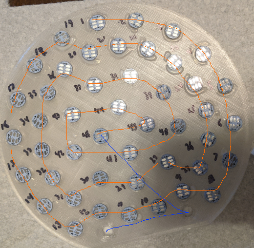
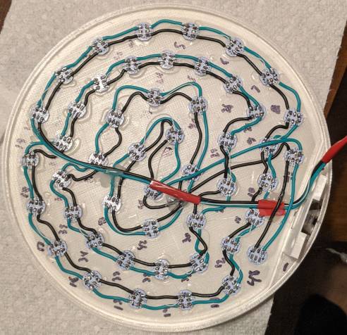
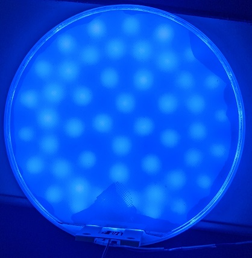
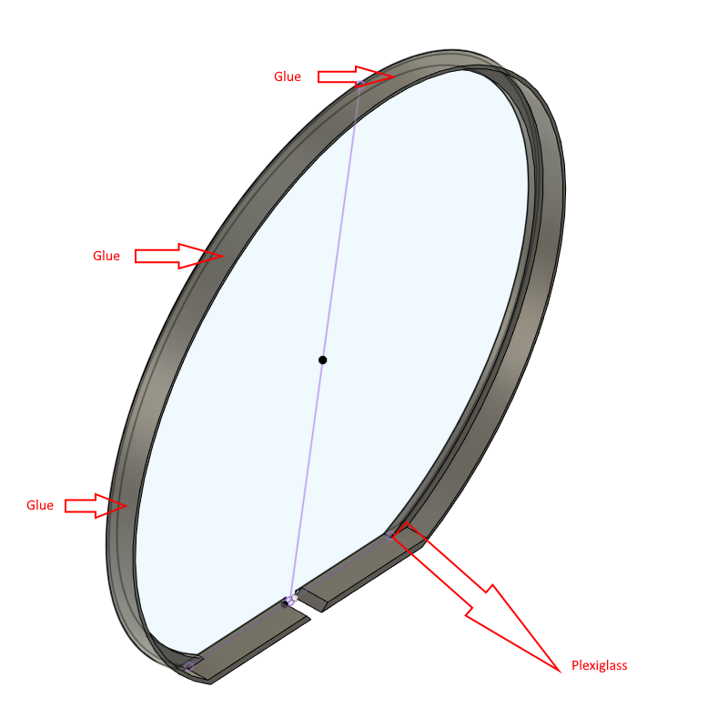
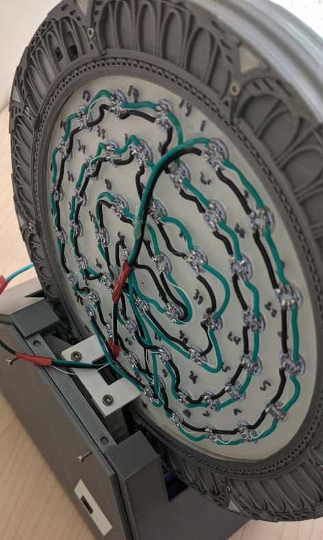

# Wormhole

## Cut the plexiglass

You need a 2 mm sheet of plexiglass. Be carefull with compass, it could leave horrible traces.

You need to cut circle of 161.5 mm into a plexiglass sheet.
You will need to cut the lower part at the right height using a dremel or use "Plexgliass-Template-Dummy.stl" as template for laser cut.

- Ensure the plexiglass part fit into "Inner-ring-0.4mm_x1.stl". You shouldn't need to force to insert it to should fit easily. Sand a little bit if necessary. DON'T GLUE IT YET !

## Apply half-way mirror film

Remove the plastic protection on the mirror film, it could be a nightmare to find but it's there.
You cannot apply it directly to the plexiglass, it won't work it will just create something horrible full of bubble and ruin your nice work.
You can check on youtube there are several tutorial about how to apply it but basically you need:
- Cut the film, it should be 1 inch bigger on every side. Ensure you get a nice spot, sometime the film could be slighly damaged. Inspect just to be sure.
- Apply water mixed with soap using a spray bottle over the plexiglass
- Remove the protection film from the mirror film
- Stick the mirror film over the plexiglass, use a ruler to push water bubble ouside

## Glue the plexiglass to "Inner-ring-0.4mm_x1.stl"

The ring shouldn't be assembled, you need to remove 9 allens screws behind the ring.

- Glue the plexiglass to the inner ring using canopy glue.

## Glue LEDs in place on "Wormhole.stl"

Use canopy glue to glue all leds in place. Use a sharpie to write each LEDs number. It is not visible so it's not really a problem.

LEDs 47 and 48 are missing on this photo because we didn't plan to use them but we did in the end.

## Solder leds

As you can see it's not perfectly optimized, because 47 and 48 were planed to not be installed but were in the end. But if you want to use a better pattern you can you will just need to slightly change the code to make it works.

## Glue the filter

The filter "Wormhole-filter.stl" is just a white PLA filter to diffuse light and make it more uniform. It is recommended to test it for real before gluing.
If you are ready to glue the filter, then you shouldn't use canopy glue because capilarity make glue do where it shouldn't.

It's not a structural part, it doesn't need an incredible bond so you can just use hot glue and spread it using a toothpick.

Example of ruined filter:

## Glue "Wormhole-outer-rim.stl"

Glue it using gorilla glue on the outside part of the "Wormhole-outer-rim.stl".
Use clamp to be sure it hold in place until glue is completely cured.

## Glue "Wormhole.stl" to "Wormhole-outer-rim.stl"

Glue wormhole behind the outer rim using canopy glue but not too much to be sure it will not drip where it shouldn't.
You don't need to put a lot of glue, a few spot is more than enough it's not a structural part also it could be useful to not overglue if you need to dismantle it later.

