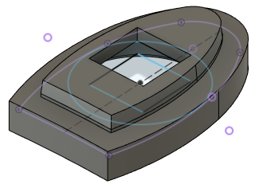
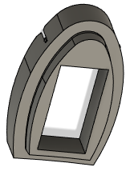
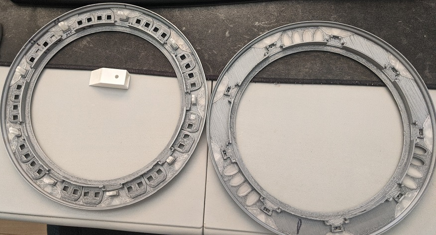

# Material prerequisite

### Electronics

| Description | Quantity | URL 
|---|---|---|
| MOSFET P Channel | 1 | https://www.aliexpress.com/item/32884055864.html?spm=a2g0o.9042311.0.0.3dbd4c4do7ZfMd |
| LEDs WS2812B | 100 | https://www.aliexpress.com/item/1005002657432751.html?spm=a2g0o.9042311.0.0.3dbd4c4do7ZfMd |
| Cooper Tape  | 1 | https://www.aliexpress.com/item/1005002822966859.html?spm=a2g0o.9042311.0.0.3dbd4c4do7ZfMd |
| Plexiglass 20x20cm (recommend buying spare)  | 1 | https://www.aliexpress.com/item/32833660352.html?spm=a2g0o.9042311.0.0.3dbd4c4do7ZfMd |
| 4x2 mm magnets  | 160 | https://www.aliexpress.com/item/1005002591601630.html?spm=a2g0o.9042311.0.0.3dbd4c4dx9x0BJ |
| Primacy film  | 25x25 cm at least | https://www.aliexpress.com/item/32967449727.html?spm=a2g0o.9042311.0.0.27424c4dzn6Avn |
| Bearing, 8mm wide, 4mm thick, 3mm inner  | 9 |   |
| M5Stack Official M5Stamp Pico | 1 |  https://www.aliexpress.com/item/1005003449579749.html?spm=a2g0o.productlist.0.0.1c9d2fabovp8Jp&algo_pvid=09bc6ccd-340d-4c7c-bcb6-1a481a010325&algo_exp_id=09bc6ccd-340d-4c7c-bcb6-1a481a010325-11&pdp_ext_f=%7B%22sku_id%22%3A%2212000025841175614%22%7D&pdp_pi=-1%3B6.65%3B-1%3B720%40salePrice%3BCAD%3Bsearch-mainSearch |
| LiPo Charger with 5v boost. It should accept 5v input and stop outputing while charging |   | Source: Dismantle dollorama battery pack to only keep the circuit |
| LiPo battery. As long as it fit into the ring it's fine  | 4x 100mA  | https://www.aliexpress.com/item/32853990764.html?spm=a2g0o.9042311.0.0.3dbd4c4do7ZfMd |
| ESP32 | 1 | Any with enough output pin will do. But don't buy node MCU they sucks |
| Fermion DFPlayer Pro Mini MP3 | 1 |   |
| DRV8825 Stepper Motor Controller | 1 |
| Resistors kit | |
| Capacitor kit | |
| A few schotky diodes | |
| All kind of wires | (24 to 26 AWG mostly) |
| 12 volts adapter, at least 2A | 1 |
| 12 volts to 5 volts step converter | 1 |
| NEMA 14 stepper | 1 | https://www.amazon.ca/0-9deg-steps-Precision-Stepper-15-6oz/dp/B00PNEPZQC
| 12 mm tactile switch | 1 | 
| Hall-Effect Sensor Digital 3144 | 1 | Any will do as long as it's digital

### Mechnical parts

| Description | Quantity | URL 
|---|---|---|
| Servo 9g | 1 |  
| M2 screws kit | 1 | 
| M3 screws kit | 1 |  

### 3D Printing parts

| Description | Quantity | URL
|---|---|---|
| Nozzle 0.2mm | 1 | Required to get nice results

### Recommendations

| Description | Quantity | URL
|---|---|---|
| Dremel Purple Glue | 1 | https://www.amazon.ca/Dremel-GS45-01-Glue-Sticks/dp/B077FVQ3DX
| Magigoo | 1 | https://shop3d.ca/products/magigoo-3d-printing-adhesive-50ml?variant=27936894287950&currency=CAD&utm_medium=product_sync&utm_source=google&utm_content=sag_organic&utm_campaign=sag_organic

# Ring assembly

- Print "Stargate-Front-0.2mm_x1.stl" using 0.2 mm nozzle 

- Print "Stargate-Back-0.2mm_x1.stl" using 0.2 mm nozzle 

- Print "Light-chevron-0.2mm_x18" 18 times using 0.2 mm nozzle 

- Print "Alignment-block-0.2mm_x9" 9 times using 0.2 mm nozzle

- Print "Module-With_wheel-0.2mm_x18.stl" 18 times using 0.2 mm nozzle

- Print "Light-chevron-cover-0.2mm-x9" 9 times using 0.2 mm nozzle. Using white PLA, it will reflect light.

- Print "Stargate-Back-TransWindow-0.2mm-x10-12" 12 times using 0.2 mm nozzle. Use transparent PLA or white.

- Print "Stargate-Back-Transparent-ToggleSw_0.2mm-x1" 1 time using 0.2 mm nozzle. Use transparent PLA or white.

- Print "Window-pushbutton_0.2mm-x1" 1 time using 0.2 mm nozzle. Use transparent PLA or white.

- Print "Magnet-ring" 1 times using 0.2 mm nozzle. Color doesn't really matter.

- Print "Inner ring" 1 times using 0.4 mm nozzle. Color doesn't really matter.

## Assembly

- Insert "Light-Chevron" into place on "Stargate-Front" and "Stargate-Back". You may need a hammer and a big metal part to force it. Be gentle to now destroy the parts. You can print "Chevron-insert-tool.stl" too to help.

