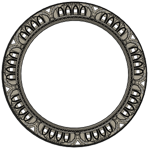
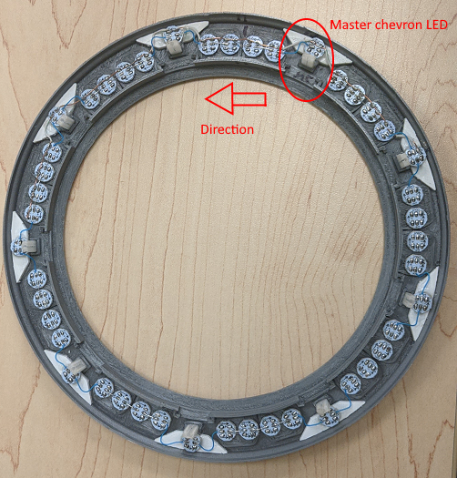

# Material prerequisite

### Electronics

| Description | Quantity | URL 
|---|---|---|
| MOSFET P Channel | 1 | https://www.aliexpress.com/item/32884055864.html?spm=a2g0o.9042311.0.0.3dbd4c4do7ZfMd |
| LEDs WS2812B | 100 | https://www.aliexpress.com/item/1005002657432751.html?spm=a2g0o.9042311.0.0.3dbd4c4do7ZfMd |
| Copper tape  | 1 | https://www.aliexpress.com/item/1005002822966859.html?spm=a2g0o.9042311.0.0.3dbd4c4do7ZfMd |
| Plexiglass 20x20cm (recommend buying spare)  | 1 | https://www.aliexpress.com/item/32833660352.html?spm=a2g0o.9042311.0.0.3dbd4c4do7ZfMd |
| 4x2 mm magnets  | 160 | https://www.aliexpress.com/item/1005002591601630.html?spm=a2g0o.9042311.0.0.3dbd4c4dx9x0BJ |
| Privacy film  | 25x25 cm at least | https://www.aliexpress.com/item/32967449727.html?spm=a2g0o.9042311.0.0.27424c4dzn6Avn |
| 693ZZ bearings (8mm wide, 4mm thick, 3mm inner)  | 9 |  https://www.aliexpress.com/item/557757520.html |
| M5Stack Official M5Stamp Pico | 1 |  https://www.aliexpress.com/item/1005003449579749.html?spm=a2g0o.productlist.0.0.1c9d2fabovp8Jp |
| LiPo Charger with 5v boost |   | https://www.aliexpress.com/item/4000935870120.html |
| LiPo battery | 4x 100mA  | https://www.aliexpress.com/item/32853990764.html?spm=a2g0o.9042311.0.0.3dbd4c4do7ZfMd (any will do as long as it fit into the ring) |
| ESP32 | 1 | Any with enough output pin will do. But don't buy node MCU they sucks |
| Fermion DFPlayer Pro Mini MP3 | 1 | https://www.aliexpress.com/item/4000394488862.html |
| DRV8825 Stepper Motor Controller | 1 | 
| Resistors kit | |
| Capacitor kit | |
| A few schottky diodes | |
| All kind of wires | (24 to 26 AWG mostly) |
| 12 volts adapter, at least 2A | 1 |
| 12 volts to 5 volts step converter | 1 |
| NEMA 14 stepper | 1 | https://www.amazon.ca/0-9deg-steps-Precision-Stepper-15-6oz/dp/B00PNEPZQC
| 12 mm tactile switch | 1 | 
| Hall-Effect Sensor Digital 3144 | 1 | https://www.aliexpress.com/item/32823025060.html (Any will do as long as it's digital)

### Mechnical parts

| Description | Quantity | URL 
|---|---|---|
| Servo 9g | 1 |  
| M2 screws kit | 1 | 
| M3 screws kit | 1 |  

### 3D Printing parts

| Description | Quantity | URL
|---|---|---|
| Nozzle 0.2mm | 1 | Required to get nice results

### Recommendations

| Description | Quantity | URL
|---|---|---|
| Dremel Purple Glue | 1 | https://www.amazon.ca/Dremel-GS45-01-Glue-Sticks/dp/B077FVQ3DX
| Magigoo | 1 | https://shop3d.ca/products/magigoo-3d-printing-adhesive-50ml?variant=27936894287950&currency=CAD&utm_medium=product_sync&utm_source=google&utm_content=sag_organic&utm_campaign=sag_organic

### MISC

| Description | Quantity | Description
|---|---|---|
| Gorilla Glue | 1 | Used to glue the most important parts.
| Canopy Glue | 1 | Need a glue that turn transparent. Gorilla glue stain the plexiglass and leave horrible traces.
| Small clamps to hold parts while curing | 1 | 

# Ring assembly

- Print "Stargate-Front-0.2mm_x1.stl" using 0.2 mm nozzle. Recommend using Tree Support with BRIM, no raft. May takes ~40h to print.

- Print "Stargate-Back-0.2mm_x1.stl" using 0.2 mm nozzle . Recommend using Tree Support with BRIM, no raft. May takes ~40h to print.

- Print "Light-chevron-0.2mm_x18" 18 times using 0.2 mm nozzle 

- Print "Alignment-block-0.2mm_x9" 9 times using 0.2 mm nozzle

- Print "Module-With_wheel-0.2mm_x18.stl" 18 times using 0.2 mm nozzle. Color doesn't matter.

- Print "Light-chevron-cover-0.2mm-x9" 9 times using 0.2 mm nozzle. Using white PLA, it will reflect light.

- Print "Stargate-Back-TransWindow-0.2mm-x10-12" 12 times using 0.2 mm nozzle. Use transparent PLA or white.

- Print "Stargate-Back-Transparent-ResetBtn_0.2mm-x1" 1 time using 0.2 mm nozzle. Use transparent PLA or white.

- Print "Stargate-Back-Transparent-PwrSw_0.2mm-x1" 1 time using 0.2 mm nozzle. Use transparent PLA or white.

- Print "Magnet-ring" 1 times using 0.2 mm nozzle. Color doesn't really matter.

- Print "symbol-light-guide_0.2mm-x36.stl" 36 times using 0.2 mm nozzle. Should use transparent or white PLA.

- Print every symbols 1 times using 0.2 mm nozzle. Should use gray PLA.
You can use a resin printer to print them and get better resolution, but resin is more transparent than gray PLA. You will need to paint the symbols after if you want correct effect using resin or too much light will go through.

- Print "Inner ring" 1 times using 0.4 mm nozzle. Color doesn't really matter.

- Print "Inner-ring-sensor-holder_0.4mm-x1" 1 times using 0.4 mm nozzle. Color doesn't really matter.

- Print "Home-magnet-holder_0.4mm-x1" 1 times using 0.4 mm nozzle. Color doesn't really matter.

## Assemble alignment block and chevrons light diffuser

Use this picture as reference: 

# Lightning diffuser for chevrons
- Insert "Light-Chevron" into place on "Stargate-Front" and "Stargate-Back". You may need a hammer and a big metal part to force it. Be gentle to now destroy the parts. You can print "Chevron-insert-tool.stl" too to help.

# Alignment blocks
- Insert "Alignment-block" into place on the "Stargate-Front" part. 
Ensure the holes are clear and everything fit. Then glue them in place, pour gorilla glue into the hole then install the alignment blocks.
- Use a sharpie and mark a chevron as being the "master chevron" on both side. Doesn't matter which one it is but it should have a master chevron. It's labelled M.C on the picture above, use the same pattern.

# Test
- Try to assemble "Stargate-Front" and "Stargate-Back" together to ensure alignment block are meshing together.

## Assemble bearing modules

- Modules are made of two part meant to mesh together and hold the bearing in sandwitch.
The part is printed 18 times so you will have 9 modules.
So the tolerance are very tight, you will have to use a lot of force to insert the bearing. If it's not hard to insert then something is wrong and you may need to change the design of the part. We suggest you to use a wrench or c-clamp to force two part together.
- Use gorilla glue to glue both part together and use clamp to hold parts

- Insert the completed modules in their final spaces to ensure everything fit in place.

## Assemble symbols

Tolerance are so tight that you will need a hammer to insert symbols in place and you need to put something behind the gate to avoid destroying it. 
You don't need glue. It may be possible you need to sand a bit to insert symbols.

- Put each "symbol-light-guide_0.2mm-x36" (36 of them) into symbol holes. 
- Insert symbols in each holes at correction positions according to the chart, the master chevron should be positionned as top most according to your previous marking.

## Assemble lights reflectors (Light-chevron-cover)

The reflectors are meant to reflect light and give a better effect so it's important to print them with white color.

- Glue "light-chevron-cover" using canopy glue over chevron "Light-chevron".
- Glue WS1228B leds over holes, there are 45 LEDs to glue using canopy glue. It's important for chevron LEDs to be as close as possible to "alignment-block" and not interfere with the ring groove. Magnet ring will be fitted there later. ** WARNING: ** There is an arrow on each LEDs, they should point in counter-clockwise direction. (See the picture)
- Starting with the "master chevron" LED, solder all LEDs positive and negative terminals. Ensure to connect the last LED to the master chevron LED to reduce voltage peak. You can use nacked wire. **Warning: ** Ensure to not overheat with the soldering iron. Be very careful to not melt the plastic under it.
- Starting with the "master chevron" LED, solder every data wire, start with the output of the master chevron LED, then connect to the next etc ...
The master chevron LED data input should be where the microcontroller will be connected later. Recommend to use very small gauge, like 28 awg.

- Add tape over symbol LEDs to project from accidental short circuit.
- Add a 3 pins connector on the master chevron LED. Servo motor connector or JST can do the job. One ground, one positive and the WS1228B led data input.

## Assemble stargate back window

You needs those parts:
- Stargate-Back-TransWindow-0.2mm-x10-12.stl (x1)

- Stargate-Back-Transparent-ResetBtn_0.2mm-x1.stl (x1)

- Stargate-Back-Window-pushbutton_0.2mm-x1.stl (x10)

### Power collector

- Use two "Stargate-Back-TransWindow-0.2mm-x10-12", wrap them using cooper tape. 
** Warning: ** The back of the cooper tape is not conductor at all, ensure both side are covered by the same piece.
- Glue them in place using gorilla glue
- Use a sharpy to mark the positive and the negative inside the ring.
- Insert the magnet into "Home-magnet-holder_0.4mm-x1" and glue it in place on "stargate-back" (check the photo for details)

- Mark polarity inside the track using a sharpie. It won't be visible once assembled.

### Other windows

- Glue other transparent window and button using this pattern.

