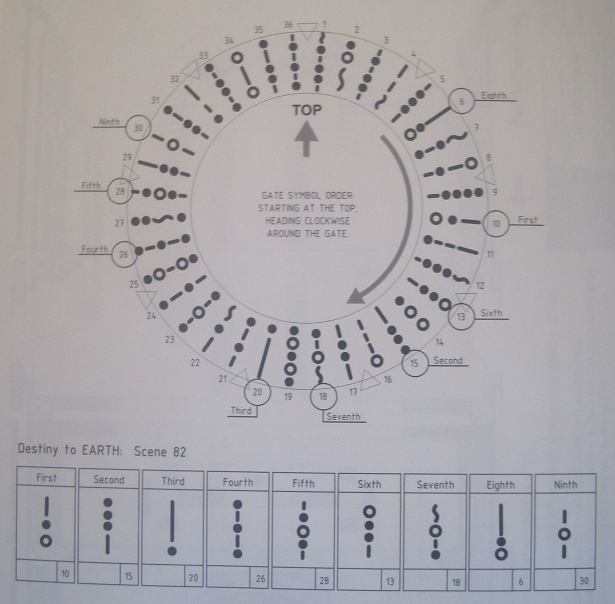

# How it works?

SG1 and SGA gate use constellation like glyth (or symbols). Unlike these, the Stargate Universe Gate uses some kind of numeral because it travel through different galaxies.

Copyright: https://stargate.fandom.com/wiki/Glyph#Milky_Way_glyphs

There are 36 symbols + 9 chevrons

| Position | Symbols | Position | Glyph | Position | Symbols |
|---|---|---|---|---|---|
| 1	 |  | 13 |  | 25 | 
| 2	 |  | 14 |  | 26 | 
| 3	 |  | 15 |  | 27 | 
| 4	 |  | 16 |  | 28 | 
| 5	 |  | 17 |  | 29 | 
| 6	 |  | 18 |  | 30 | 
| 7	 |  | 19 |  | 31 | 
| 8	 |  | 20 |  | 32 | 
| 9	 |  | 21 |  | 33 | 
| 10 |  | 22 |  | 34 | 
| 11 |  | 23 |  | 35 | 
| 12 |  | 24 |  | 36 | 

# Stargate Layout

From Joseph Malozzi blog:

Final layout in the serie:

