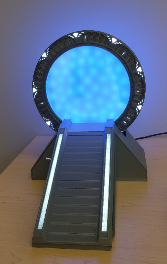
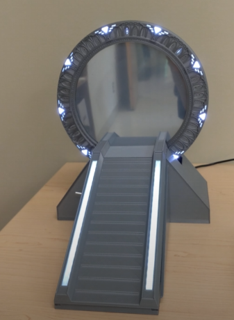

**Warning**: This project contains several hundred parts to print and hundreds hours of print. 
If you decide to take this path you will suffer a lot, you may lost some compatriot in the battle.
You will no longer be the same after that, it could also cause hair loss.

# Stargate Universe

This project is basically a small stargate made to decorate your desk. It feature lightning for symbols like in the serie and the ring spins.
https://www.youtube.com/channel/UCcdElKiCrVWVq5p8XVurI4g for more details.

Unfortunately this project went through a lot of trial and error, so there are more parts than it should have especially in the base.
Optimize it would require making a second gate to test new optimization. I'm no willing to do that now.

Still writing the print and assembly manual, more will come later including the source code and wiring diagrams to operate the system.

Inspired partly by: https://thestargateproject.com/build-a-stargate-and-dhd-3d-printed/

# Knowns issues

- I used 1A 12v to 5v, the servo motor moving can cause brownout.
- Running the wormhole continously seems to prevent correct charge of the ring and cause weird glitches. May be caused by unsufficient 12v to 5v converter amperage.

# Copyrights & Thanks

Some fonts:
|File | Info
|---|---
| stargateuniverse.woff | Created by : Gilles Nuytens (http://www.thescifiworld.net/fonts.htm)
| eurostile_extended2_bold.woff | https://fontsgeek.com/fonts/eurostile-extended-2-bold?ref=readme
| ancient_virtual.ttf.woff | Created by VirtualCLD (http://www.thescifiworld.net/fonts.htm)

# Parts to print

##  Ring

| File name | Count |
|---|---|
| Alignment-block-0.2mm_x9.stl | 9
| Chevron-insert-tool.stl | 1
| Home-magnet-holder_0.4mm-x1.stl | 1
| Inner-ring-0.4mm_x1.stl | 1
| Inner-ring-sensor-holder_0.4mm-x1.stl | 1
| Light-chevron-0.2mm_x18.stl | 18
| Light-chevron-cover-0.2mm-x9.stl | 9
| Magnet-ring-0.2mm-x1.stl | 1
| Module-With_wheel-0.2mm_x18.stl | 18
| Stargate-Back-0.2mm_x1.stl | 1
| Stargate-Back-Transparent-PwrSw_0.2mm-x1 | 1
| Stargate-Back-Transparent-ResetBtn_0.2mm-x1 | 1
| Stargate-Back-TransWindow-0.2mm-x10-12.stl | 12
| Stargate-Front-0.2mm_x1.stl | 1
| Symbols/symbol-template10_0.2mm-x1.stl | 1
| Symbols/symbol-template11_0.2mm-x1.stl | 1
| Symbols/symbol-template12_0.2mm-x1.stl | 1
| Symbols/symbol-template13_0.2mm-x1.stl | 1
| Symbols/symbol-template14_0.2mm-x1.stl | 1
| Symbols/symbol-template15_0.2mm-x1.stl | 1
| Symbols/symbol-template16_0.2mm-x1.stl | 1
| Symbols/symbol-template17_0.2mm-x1.stl | 1
| Symbols/symbol-template18_0.2mm-x1.stl | 1
| Symbols/symbol-template19_0.2mm-x1.stl | 1
| Symbols/symbol-template1_0.2mm-x1.stl | 1
| Symbols/symbol-template20_0.2mm-x1.stl | 1
| Symbols/symbol-template21_0.2mm-x1.stl | 1
| Symbols/symbol-template22_0.2mm-x1.stl | 1
| Symbols/symbol-template23_0.2mm-x1.stl | 1
| Symbols/symbol-template24_0.2mm-x1.stl | 1
| Symbols/symbol-template25_0.2mm-x1.stl | 1
| Symbols/symbol-template26_0.2mm-x1.stl | 1
| Symbols/symbol-template27_0.2mm-x1.stl | 1
| Symbols/symbol-template28_0.2mm-x1.stl | 1
| Symbols/symbol-template29_0.2mm-x1.stl | 1
| Symbols/symbol-template2_0.2mm-x1.stl | 1
| Symbols/symbol-template30_0.2mm-x1.stl | 1
| Symbols/symbol-template31_0.2mm-x1.stl | 1
| Symbols/symbol-template32_0.2mm-x1.stl | 1
| Symbols/symbol-template33_0.2mm-x1.stl | 1
| Symbols/symbol-template34_0.2mm-x1.stl | 1
| Symbols/symbol-template35_0.2mm-x1.stl | 1
| Symbols/symbol-template36_0.2mm-x1.stl | 1
| Symbols/symbol-template3_0.2mm-x1.stl | 1
| Symbols/symbol-template4_0.2mm-x1.stl | 1
| Symbols/symbol-template5_0.2mm-x1.stl | 1
| Symbols/symbol-template6_0.2mm-x1.stl | 1
| Symbols/symbol-template7_0.2mm-x1.stl | 1
| Symbols/symbol-template8_0.2mm-x1.stl | 1
| Symbols/symbol-template9_0.2mm-x1.stl | 1
| symbol-light-guide_0.2mm-x36.stl | 36
| Lower-bridge-0.4mm-x1.stl | 1
| TOTAL | 148

## Base

| File name | Count |
|---|---|
| Back-plunger-anchor_4mm-x2.stl | 2
| Back-plunger-arm_4mm-x1.stl | 1
| Back-plunger-bar_4mm-x1.stl | 1
| Back-plunger-Higher-spring_4mm-x1.stl | 1
| Back-plunger-Lower-spring_4mm-x1.stl | 1
| black-plunger-hammer-cover_4mm-x1.stl | 1 
| black-plunger-hammer_4mm-x1.stl | 1
| Board-holder_4mm-x1.stl | 1
| Bottom-plate-v2_4mm-x1.stl | 1
| magnet-gear_4mm-x1.stl | 1
| Mechanic-Anchor-L_4mm-x1.stl |1 
| Mechanic-Anchor-R_4mm-x1.stl | 1
| Mechanic-Archor-p2-L_4mm-x1.stl | 1
| Mechanic-Archor-p2-R_4mm-x1.stl | 1
| Outer-back-cover-plug-blocking_4mm-x1.stl | 1
| Outer-back-cover-plug_4mm-x1.stl | 1
| Outer-back-cover_4mm-x1.stl | 1
| Outer-back-plate-reinforcement_4mm-x1.stl | 1
| Outer-back-plate_4mm-x1.stl | 1
| Outer-bottom-plate2_4mm-x1.stl | 1
| Outer-bottom-plate_4mm-x1.stl | 1
| Outer-front-plate_4mm-x1.stl | 1
| Outer-side-plate#1_4mm-x1.stl | 1
| Outer-side-plate#2_4mm-x1.stl | 1
| ramp-light-guide_4mm-x2.stl | 2
| Ramp_4mm-x1.stl | 1
| Side-back-cover-L_4mm-x1.stl | 1
| Side-back-cover-R_4mm-x1.stl | 1
| Side-ramp-cover-L_4mm-x1.stl | 1
| Side-ramp-cover-R_4mm-x1.stl | 1
| spacer_4mm-x4.stl | 4
| Stepper-bracket_4mm-x1.stl | 1
| Stepper-mount-1_4mm-x1.stl | 1
| Stepper-mount-2_4mm-x1.stl | 1
| top-cover_4mm-x1.stl | 1
| Truss#1_4mm-x1.stl | 1
| Truss#2_4mm-x1.stl | 1
| Side-overcover-L_4mm-x1.stl | 1
| Side-overcover-R_4mm-x1.stl | 1
| TOTAL | 44

## Wormhole

| File name | Count |
|---|---|
| Wormhole.stl | 1
| Wormhole-outer-rim.stl | 1
| Wormhole-filter.stl | 1
| TOTAL | 3
